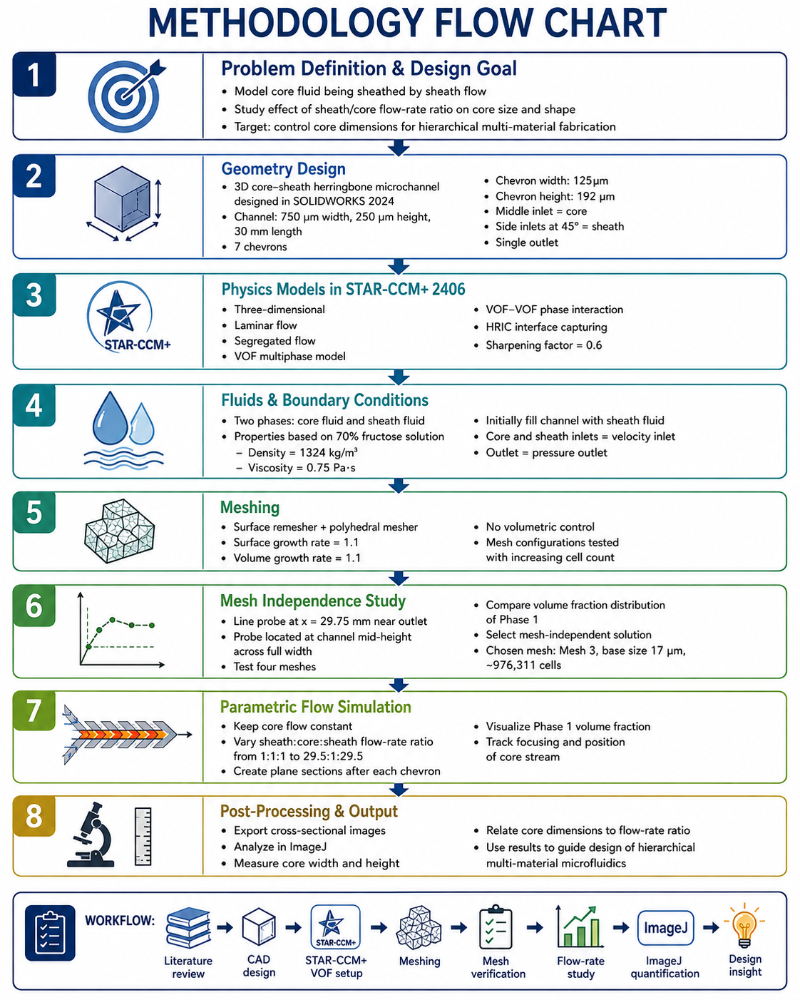
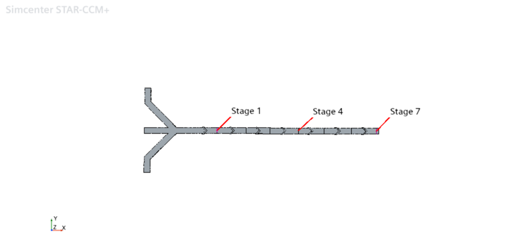
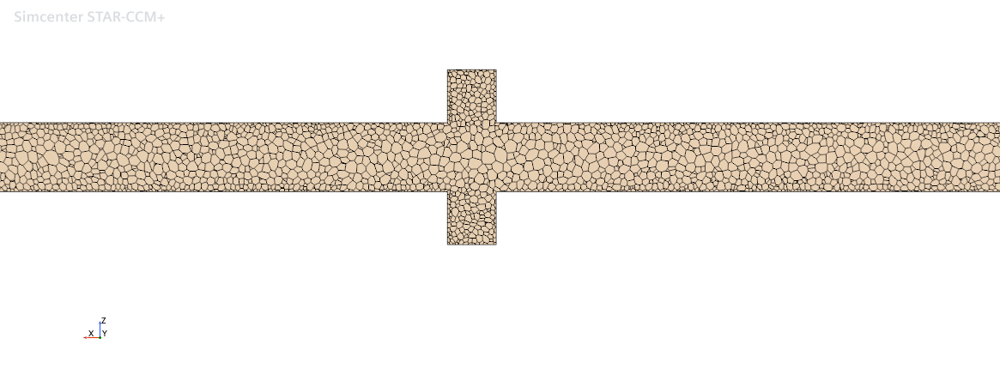
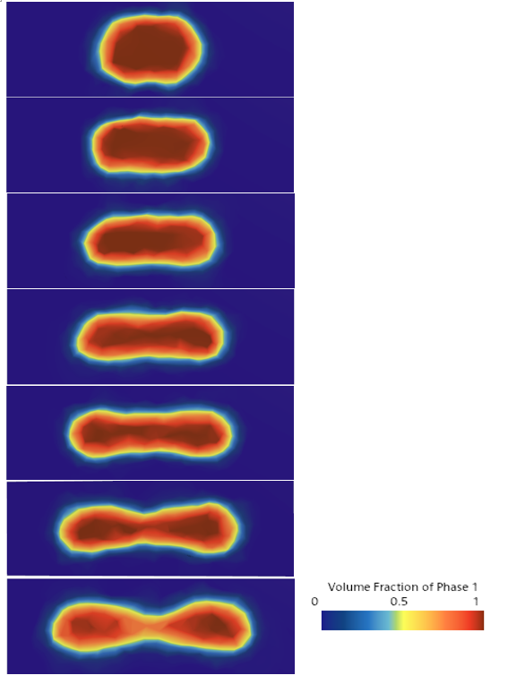

# Core-Sheath Microfluidic Flow Simulation Using VOF

Three-dimensional CFD study of hydrodynamic focusing in a chevron-patterned microfluidic channel using the Volume of Fluid (VOF) method in **STAR-CCM+ 2406**.

## Project Overview

This project investigates how the sheath-to-core flow-rate ratio and downstream chevron structures control the size, position, and cross-sectional shape of a core stream in a microfluidic channel. The model was developed to support the controlled fabrication of hierarchically structured multimaterial fibers.

The channel geometry was designed in **SOLIDWORKS 2024**, simulated in **STAR-CCM+**, and postprocessed in **ImageJ**. A mesh-independence study was completed before the parametric simulations.

## Objectives

- Develop a three-dimensional core-sheath microfluidic model.
- Capture the interface between the core and sheath phases without modeling bulk mixing.
- Determine how successive chevrons reshape the core stream.
- Quantify the effect of sheath-to-core flow-rate ratio on core width and height.
- Verify that the selected mesh provides a grid-independent result.

## Methodology

<p align="center">

</p>

### 1. Channel Geometry

The device contains one central core inlet, two symmetric sheath inlets, and one outlet. The sheath streams enter from the sides at 45 degrees. Seven chevrons are located on the top and bottom channel surfaces to redirect the sheath flow around the core.

| Parameter | Value |
|---|---:|
| Channel length | 30 mm |
| Channel width | 750 µm |
| Channel height | 250 µm |
| Number of chevrons | 7 |
| Chevron width | 125 µm |
| Chevron height | 192 µm |
| Sheath-inlet angle | 45 degrees |

<p align="center">
  
</p>

### 2. Numerical Model

The simulations used the following STAR-CCM+ physics models:

- Three-dimensional flow
- Laminar flow
- Segregated flow solver
- Volume of Fluid multiphase model
- VOF-VOF phase interaction
- High Resolution Interface Capturing (HRIC)

The HRIC sharpening factor was set to **0.6** to reduce numerical diffusion and preserve a sharp interface between the phases. Phase 1 represented the core fluid and Phase 2 represented the sheath fluid.

The VOF formulation solves the phase volume-fraction transport equation together with conservation of mass and momentum. The local core-phase volume fraction, `alpha_core`, identifies whether a cell contains sheath fluid (`alpha_core = 0`), core fluid (`alpha_core = 1`), or the interface (`0 < alpha_core < 1`).

### 3. Material Properties and Boundary Conditions

The assigned properties represented a 70% fructose solution.

| Quantity | Value |
|---|---:|
| Density | 1324 kg/m³ |
| Dynamic viscosity | 0.75 Pa·s |
| Core inlet | Velocity inlet |
| Two sheath inlets | Velocity inlets |
| Outlet | Pressure outlet |
| Initial channel condition | Filled with sheath phase |

The core flow rate was held constant while the two sheath flow rates were increased symmetrically. The investigated sheath:core:sheath conditions extended from **1:1:1** to **29.5:1:29.5**. Cross-sectional planes after successive chevrons were used to examine the downstream evolution of the core phase.

### 4. Meshing and Grid Independence

A polyhedral volume mesher and surface remesher were used. Surface and volume growth rates were both set to **1.1**. No separate volumetric refinement control was applied because the selected base sizes resolved the geometric features.

For the grid study, the core and sheath inlet velocities were each set to **8.9 x 10^-5 m/s**. A line probe was positioned at `x = 29.75 mm`, near the outlet, at the channel mid-height and across the full width. Grid sensitivity was assessed from the Phase 1 volume-fraction profile along this probe.

| Mesh | Base size (µm) | Cells | Pure-core distance (µm) | Change (%) |
|---:|---:|---:|---:|---:|
| 1 | 25 | 420,470 | 337.5 | 0.0 |
| 2 | 20 | 680,930 | 375.0 | 11.1 |
| **3** | **17** | **976,311** | **450.0** | **20.0** |
| 4 | 15 | 1,264,518 | 450.0 | 0.0 |

Mesh 3 and Mesh 4 predicted the same pure-core distance of **450 µm**. Mesh 3 was therefore selected for the parametric simulations because additional refinement increased computational cost without changing this monitored result.

<p align="center">
  
</p>

### 5. Postprocessing

Core-phase volume-fraction images were exported at selected channel stages and flow-rate ratios. The images were analyzed in **ImageJ** to measure the width and height of the core region. These measurements were then plotted against the sheath-to-core flow-rate ratio.

## Results and Discussion

### Downstream Evolution of the Core Phase

At the entrance, the symmetric sheath streams compressed the central core laterally. Farther downstream, the top and bottom chevrons redirected part of the sheath flow toward the upper and lower channel surfaces, introducing vertical deformation.

As the flow passed through Stages 1-7, the core cross section changed from an initially compact profile to a more elongated and flattened shape and ultimately developed a dumbbell-like morphology. This result demonstrates that the chevron geometry controls not only the core size but also its cross-sectional shape.

<p align="center">
  
</p>

### Effect of Sheath-to-Core Flow-Rate Ratio

The Stage 7 core profiles were compared at sheath-to-core ratios of **2.5, 7, 14.5, and 29.5**. Increasing the sheath flow strengthened hydrodynamic focusing and progressively confined the core stream in the lateral direction.

<p align="center">
  
</p>

### Quantitative Core Dimensions

The core width decreased sharply from approximately **250 µm** at a sheath-to-core ratio of **2.5** to approximately **120 µm** at a ratio of **29.5**, corresponding to a reduction of roughly **52%**. The stronger sheath flow increased lateral confinement and reduced the horizontal spread of the core.

In contrast, the core height remained close to **120 µm** across the tested ratios. Therefore, changing the sheath flow primarily controlled the **width** of the core, whereas the vertical dimension was comparatively insensitive and remained constrained by the channel geometry.

<p align="center">
  
</p>

## Key Findings

- The VOF-HRIC model successfully maintained a distinct core-sheath interface.
- Symmetric sheath inlets initially produced lateral compression of the core stream.
- Successive chevrons redirected the sheath flow and transformed the core into an elongated, flattened, and eventually dumbbell-like cross section.
- Increasing the sheath-to-core ratio from 2.5 to 29.5 reduced the core width from approximately 250 µm to 120 µm.
- The core height remained approximately 120 µm, showing that the tested flow-rate ratio mainly controlled lateral confinement.
- Mesh 3, containing **976,311 cells**, produced the same monitored pure-core distance as the finer 1,264,518-cell mesh and was selected as the grid-independent configuration.

> **Main conclusion:** The sheath-to-core flow-rate ratio provides strong control over core width, while the chevron geometry governs the downstream deformation and morphology of the core phase.

## Limitations

- Experimental validation of the predicted core dimensions was not completed in this study.
- Surface tension and wall contact angle were not included; their omission may have contributed to the slightly off-center core positions predicted at ratios of 14.5 and 29.5.
- High-viscosity solutions may obstruct microchannels or syringe tubing at very low experimental flow rates.
- The mesh-independence conclusion is based on the selected outlet volume-fraction metric; additional local and integral quantities could be monitored in future verification studies.

## Software and Skills Demonstrated

- **CAD:** SOLIDWORKS 2024
- **CFD:** STAR-CCM+ 2406
- **Multiphase modeling:** Volume of Fluid (VOF)
- **Interface capturing:** HRIC
- **Meshing:** Polyhedral mesher and surface remesher
- **Verification:** Grid-independence analysis
- **Postprocessing:** STAR-CCM+ scalar scenes and ImageJ measurements
- **Application:** Hydrodynamic focusing and core-sheath microfluidics

## Suggested Repository Structure

```text
core-sheath-microfluidic-cfd/
|-- README.md
|-- images/
|   |-- Figure_11_Core_Sheath_Geometry.png
|   |-- Figure_12_Mesh_Structure.png
|   |-- Figure_13_Mesh_Independence_Volume_Fraction.png
|   |-- Figure_14_Core_Phase_Stages_1_to_7.png
|   |-- Figure_15_Core_Phase_Different_Flow_Ratios.png
|   `-- Figure_16_Core_Width_Height_vs_Sheath_Core_Ratio.png
|-- geometry/
|-- mesh/
|-- results/
`-- docs/
```

## Reference

This repository summarizes the sheathing-simulation portion of:

T. Islam, *Modeling and Manufacturing of Hierarchically Structured Multi-Materials via Microfluidics*, M.S. thesis, Montana State University, 2025.

## Acknowledgment

This work was supported by the National Science Foundation under Award No. **2144845**.
